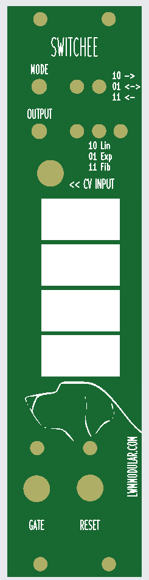
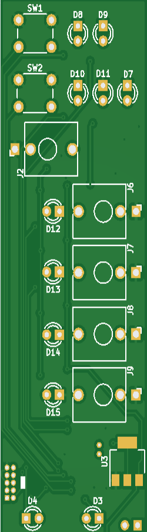
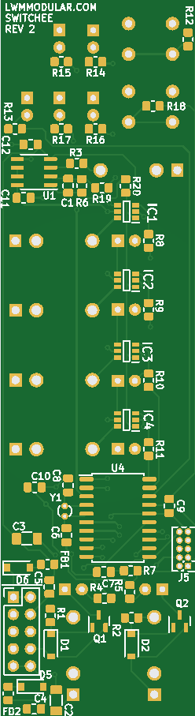

# Switchee Eurorack Module
Switchee is a Eurorack signal switcher using the ATSAMD10D14A. It's a fairly simple design that uses the MCU to control DG447 analog signal switchers. The DG447 a cheap and can handle the full voltage bandwidth of typical Eurorack signals. Assemble is with SMD components, and the PCB falls into budget range of JLCPCB. When this was designed in 2022, you could build a unit for under $30. Even cheaper if you wanted to build ten units.

The default behavior is to advance the output from one to four for each trigger input. The mode button changes this behavior. There are three counting modes: linear, exponential (up to 1024), and fibonacci. In exponential mode, it takes an increase number of triggers to advance the counter and change the output. For example, 2, 4, 8, 16, etc. The fibonacci mode is similiar: it takes 1, 1, 2, 3, 5, 8 and so on triggers to change the output routing.

The module has:
* A TRIGGER input that changes the output
* A Signal input that is buffered and routed to one of four outputs
* A Reset input that changes the switching back to Output One
* A Mode button 

This project includes the PCB, PCB front panel, and firmware. Firmware is downloaded to the ATSAMD10 via ATMEL ICE.

The PCB is done in Kicad. There are fab-ready gerbers in the gerbers/ directory. The main firmware file is in firmware/main.c

